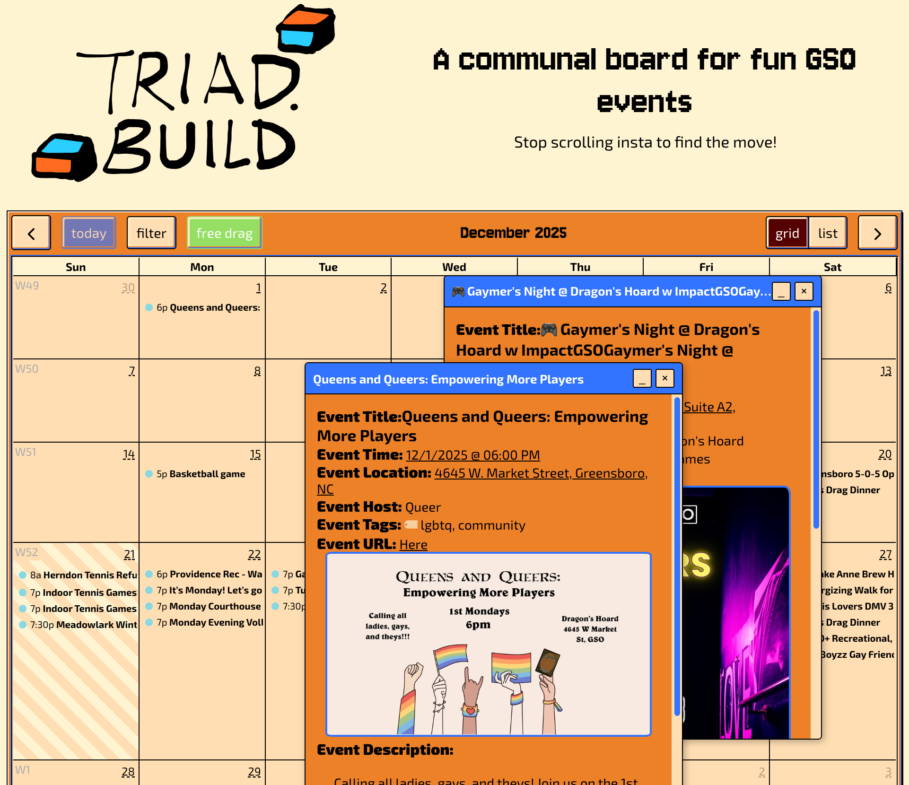
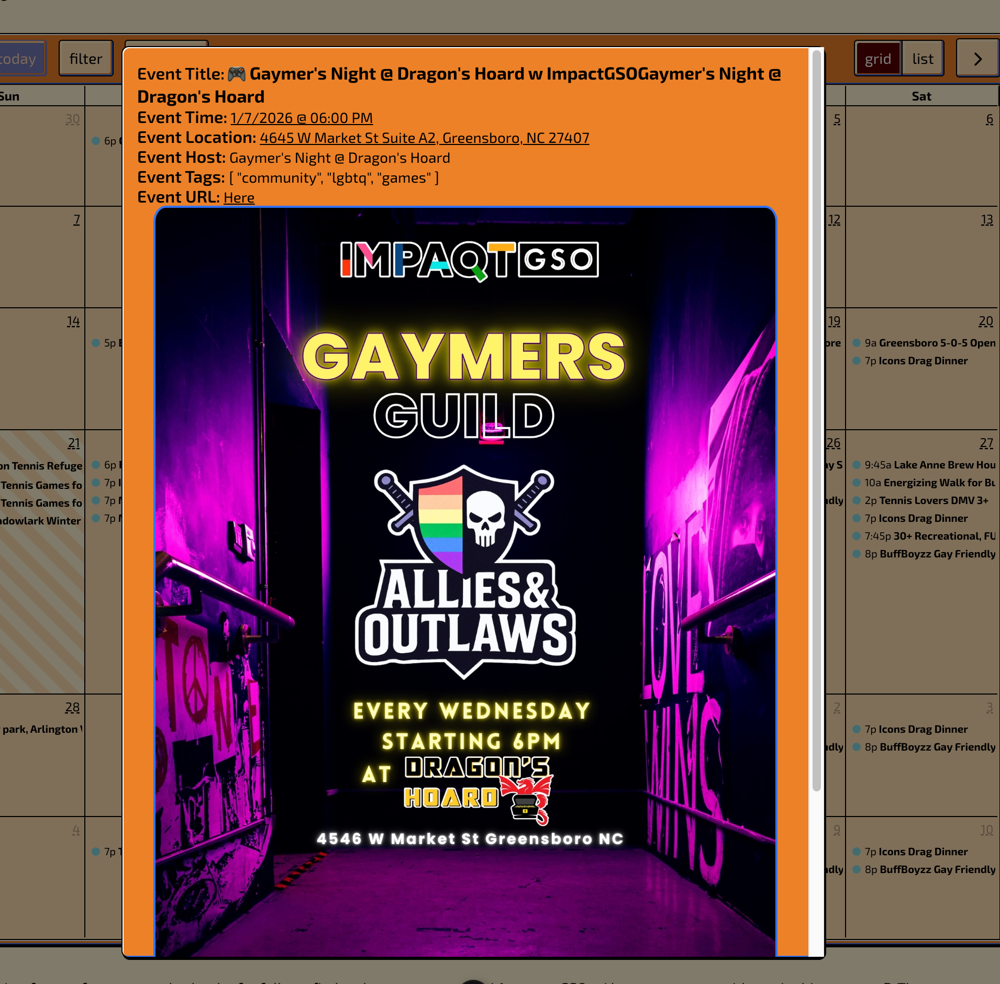

# Triad.build

## Mission Statement

This project's purpose is to help people in GSO and greater area know what's going on with the neighbourhood, build connections and maybe by having a place to list things, will come up with more ways to connect with one another.

## Why I want to build this

I just moved to this place after breaking up with my girlfriend. I am devastated to know more friends!!!

## How do I add my events to this website?

You have two options!

1. Email me at leileixiawork@gmail.com with a Google Calendar you'd like to share :)
2. Fork this project and open a pull request with your changes added to ~~/assets/event_sources.json

todo: make this into a page on triad.build so it's more accessible

## Local Quickstart

If you want to run the entire application locally, visit [QUICKSTART.md](QUICKSTART.md).

## How do I fork this and host it for my city?

`~~/components/App.vue` is the entry point for this website, and in order to get a MVP for you to test yourself you simply have to find where `const endpoints` is defined and comment out all the APIs inside the function. Keep in mind this is simply my workflow, but some more defined steps are below:

- I recommend using one of these text editors with this project: `vscode` or `vscodium` (available on Windows, Linux, Mac)
- Install `npm`
- Fork this project and pull your github remote to initiate a local git repo on your pc
- copy the path name of the folder you just cloned, open your terminal, type in `cd [the directory path you had]` and hit enter, you just locate your terminal into the root directory of this project
- in your terminal, run the commands `npm install`, `npm audit fix`, and then `npm run dev -- -o` to launch your local dev environment.
- Search for `const endpoints`'s definition in App.vue and comment out all the APIs in order to stop them from loading.
- Copy `sample.env` into a new file named simply `.env` in the root folder and try and fill out as many of the keys as possible, or as is desired for the scope of your project.
- to change and add events you want to have, go to `~~/assets/event_sources.json` and change the event sources.
- Begin modifying `const endpoints` again to start uncommenting the APIs you want to target one by one to ensure they work completely
  - In my experience it's completely normal for your event grabbing to work and it not show visually on a local dev preview environment, so if you can get Vercel up and running try and open a development branch and publish your changes there to see if it'll work in a real world environment. There may be better ways to do this but I'm just a lady trying her best with computers.
- When you are finished and satisfied with your code (or want to start getting ready to target production) begin connecting your github repo with Vercel, I'm shocked at how easy it was, leave all the settings at default except to make sure that Vercel knows this repository is targetting the Nuxt framework. Add the environment variables and bing bong so simple you should be done! Behold your labors and maybe add a domain.

## Screenshots

## Todo
- [ ] add city tags
- [ ] add calendar submission form
- [ ] add one-off event submission and review form
- [ ] fix not reading multiple images issue (with back table gso)
- [ ] contact more orgs about triad.build